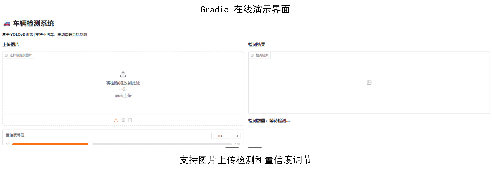
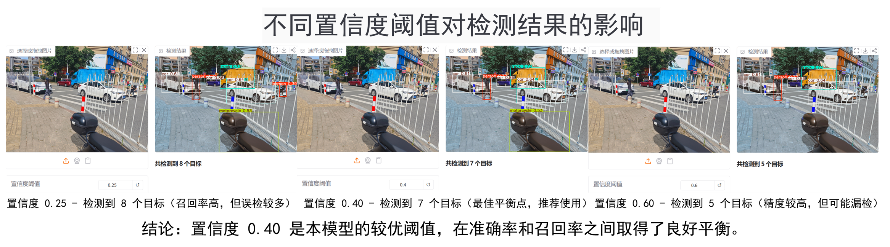
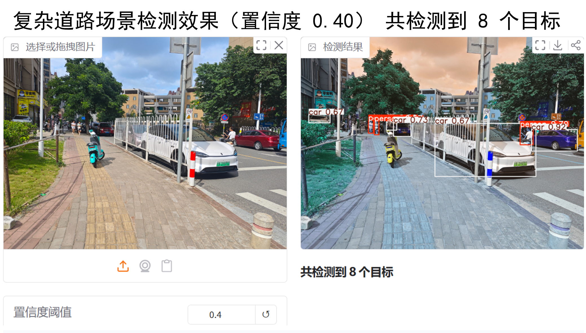

# 🚗 车辆检测系统 - YOLOv8

基于 YOLOv8 + ByteTrack 实现的实时多目标检测与跟踪系统，支持车辆计数和轨迹显示。

## 在线演示

**[🔗 点击体验在线 Demo](https://d6c67bfc55b18bc2e9.gradio.live)**
**Demo 链接**：https://d6c67bfc55b18bc2e9.gradio.live

## 项目展示

### 功能特点
- 实时车辆检测
- 多目标跟踪（ByteTrack）
- 实时数量统计
- 轨迹可视化

### Demo 界面


### 不同置信度阈值对比


**结论**：置信度 **0.40** 是本模型的较优阈值，在准确率和召回率之间取得了良好平衡。

### 检测效果示例


## 模型性能

- **mAP@50**：99.1%
- **Precision**：99.2%
- **Recall**：97.5%
- **F1 Score**：97.8%

## 技术栈

- **检测模型**：YOLOv8(Roboflow 3.0)
- **跟踪算法**：ByteTrack (Supervision)
- **Web 框架**：Streamlit
- **数据集**：Roboflow 自定义车辆数据集(347 张图片)

## 如何本地运行

```bash
pip install ultralytics supervision streamlit opencv-python
streamlit run app.py
```` ``` ````
🚀 未来改进计划
支持更多类别检测：扩展数据集，支持公交车、卡车等更多交通工具的检测。

增加异常行为检测：引入行为识别算法，检测违章变道、行人闯红灯等异常。

跨平台部署：尝试将模型轻量化（如转为 ONNX/TensorRT），并部署到移动端（Android/iOS）。
